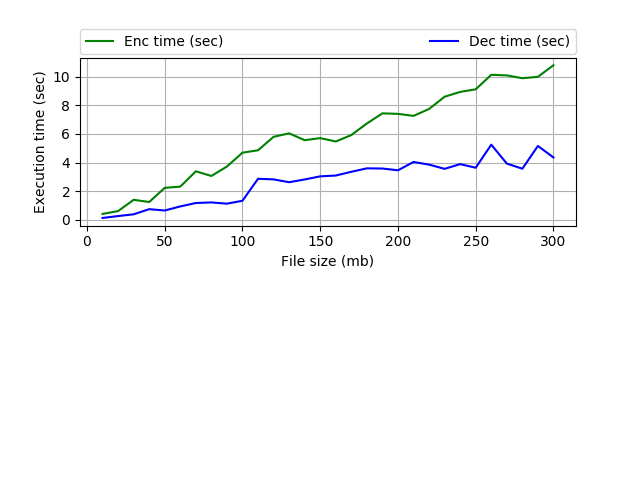

# Test task

Make benchmark of AES 256 with key lenght 32 bytes. Cipher Block Chaining (CBC) mode was used.

## Installation
- Clone.  git clone https://github.com/LarisaShcherbachenko/TestTaskRobin8.git

- Create virtualenv

```bash
virtualenv --python=python3.6 venv
pip3 install -r requirements.txt
```

- For instaling pycrypto download library from https://pypi.python.org/pypi/pycrypto, extract and execute next commands:

```bash
cd pycrypto-2.6.1/
python setup.py build
python setup.py install
```

- Install Matplotlib:

```bash
sudo apt-get install python3-matplotlib
```

Run script from the 'TestTaskRobin8' directory:

```bash
python3 'main.py'
```

For running tests execute next command from the 'TestTaskRobin8' directory:

```bash
python3 'test.py'
```

### Software structure description

- `TestTaskRobin8`
    - `main` --- main module
    - `test` --- test module 
    - `files` --- file storage
    	- `enc` --- files storage
    	- `dec` --- encoded files storage
    	- `plain` --- decrypted files storage
    - `benchmark_res.csv` --- benchmark results
    - `Readme.md` --- readme file
    - `requirements.txt` --- contain set of needed libraries
    - `pycrypto-2.6.1.tar.gz` --- cryptography library

Example of result:

```bash
Init directories
Start file generation
Start benchmark
Size (Mb)      Enc time (sec) Dec time (sec) 
10.0           0.408293       0.125837       
20.0           0.605322       0.259295       
30.0           1.395399       0.381066       
40.0           1.241156       0.740278       
50.0           2.231279       0.646634       
60.0           2.318182       0.933231       
70.0           3.387128       1.171361       
80.0           3.061750       1.211986       
90.0           3.723067       1.125548       
100.0          4.690845       1.328220       
110.0          4.857966       2.865827       
120.0          5.799391       2.822414       
130.0          6.042006       2.624558       
140.0          5.562914       2.816808       
150.0          5.707892       3.035391       
160.0          5.472506       3.092909       
170.0          5.922696       3.354553       
180.0          6.730800       3.594475       
190.0          7.440262       3.582762       
200.0          7.404185       3.458436       
210.0          7.261659       4.040173       
220.0          7.746890       3.856228       
230.0          8.601915       3.559688       
240.0          8.939324       3.890504       
250.0          9.120617       3.636732       
260.0          10.135458      5.249827       
270.0          10.094357      3.929704       
280.0          9.896256       3.569788       
290.0          9.992903       5.160242       
300.0          10.803707      4.354974       
/home/larysa/PythonProjects/TestTaskRobin8/benchmark_res.csv
Program is executed in 371.06544947624207 seconds.
```


